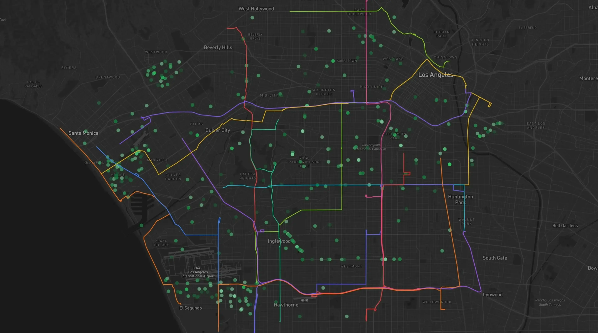
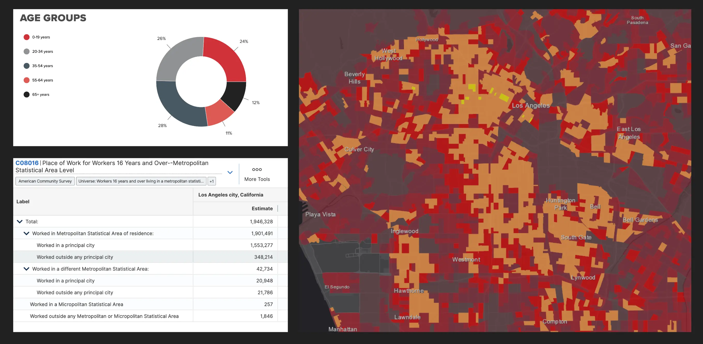
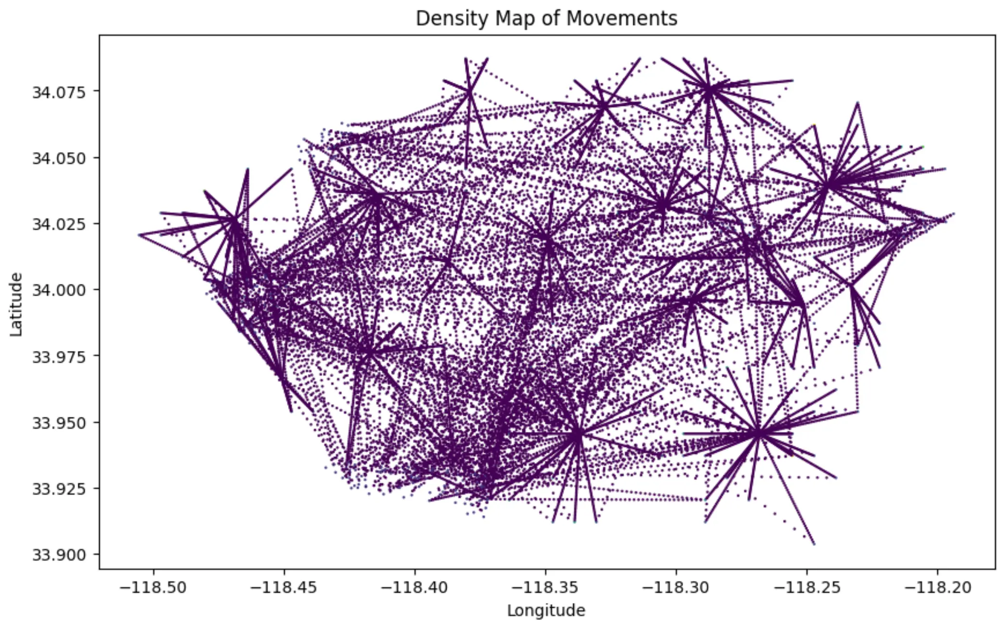
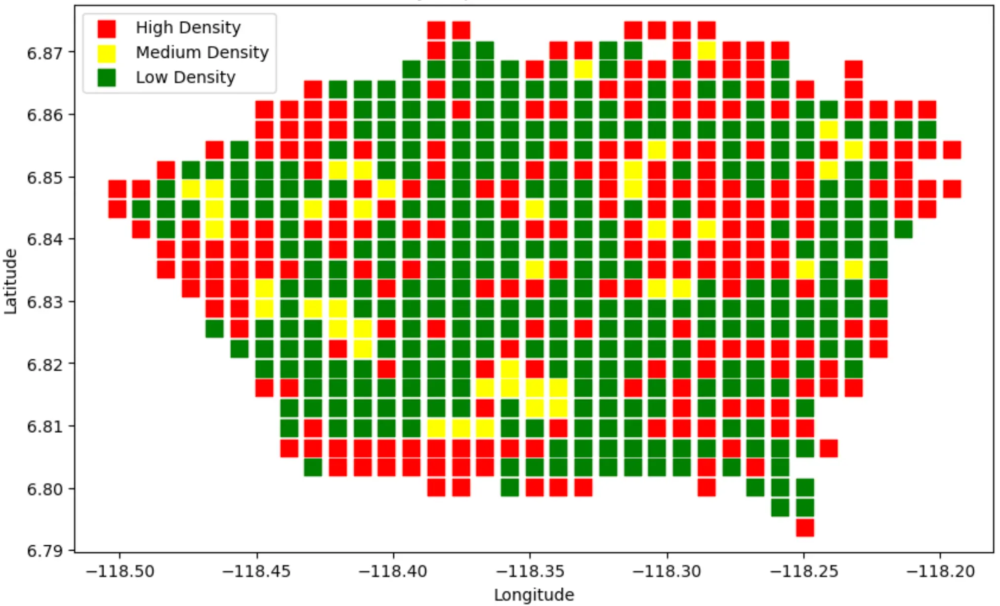
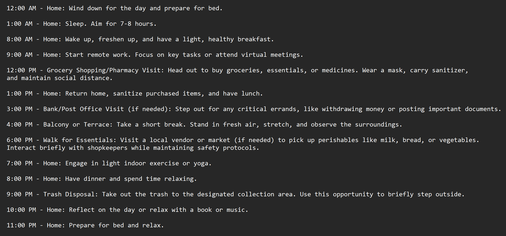

### COVID Digital Twin & Containment Simulation

### Objectives

1. **Simulate Realistic Human Agents to Model Urban Dynamics:**  
   Our project creates a digital twin of a city by simulating human-like agents. These agents are endowed with realistic demographics, daily routines, and social behaviors that evolve over time. By capturing the nuances of individual actions and interactions, we aim to uncover emergent patterns in urban environments—insights during disease outbreaks, that can drive optimized planning and resource allocation.

2. **Train Reinforcement Learning (RL) Agents to Derive Optimal Disease Containment Policies:**  
   In parallel, we leverage RL to explore and identify intervention strategies that effectively contain the spread of disease during outbreaks. The RL agents learn from simulated scenarios to determine when and how to implement measures (such as lockdowns) to minimize infections while balancing societal impacts.

### Overview

Our project merges advanced agent-based modeling with reinforcement learning. We build a dynamic digital twin of a city (modeled on Los Angeles) where each AI agent mimics realistic human behavior—complete with age, occupation, and even daily routines generated via chain-of-thought reasoning.
This holistic approach not only reveals how diseases can propagate through complex urban systems but also empowers us to experiment with adaptive policies for disease containment.

Sample simulation of environment


### Key Features

- **Digital Twin of a City:**  
  Our simulation places thousands of human-like agents within a realistic geographic and social landscape. These agents interact, move, and evolve over time to simulate a COVID time environment based on data collected form previous pandemics/epidemics.  

- **Chain-of-Thought Driven Routines:**  
  By utilizing large language models to generate detailed daily routines, each agent exhibits unique behavior patterns that closely mirror real-life scenarios. This adds a critical layer of depth to our simulation, capturing the variability in human decision-making during times of epidemics.

- **Reinforcement Learning Integration:**  
  We wrap our simulation within a custom OpenAI Gym environment, enabling RL agents to learn policies that dynamically adjust intervention measures. Using techniques such as Proximal Policy Optimization (PPO), the RL models aim to minimize the spread of disease while considering the overall wellbeing of the simulated population.
  1. Can induce lockdowns in specifc areas of the city to control spread. 
  2. Predicts shortages in medicines, ICUs and other medical equipments based on transit routes and COVID time environment simulations. 

- **Modular Architecture:**  
  The project is organized into three main modules:
  - **Frontend:** A Next.js web application providing interactive dashboards, maps (via Leaflet), and charts (via Chart.js) to visualize simulation outcomes.
  - **Backend:** A FastAPI server that hosts the simulation engine, agent-based modeling components, and chain-of-thought logic.
  - **ML/RL Module:** Scripts and notebooks for training RL agents using stable-baselines3 in a custom Gym environment.

Some data visualizations:
1. Census/COVID time data

2. Pandemic time movement recordings

3. Covid infection rate


### How It Works

1. **Agent-Based Simulation:**  
   Agents are initialized with unique profiles and daily routines. They move across a digital representation of the city, interact with one another, and may become infected based on proximity and predefined epidemiological parameters.

2. **Data-Driven Urban Modeling:**  
   The simulation continuously tracks temporal and spatial data, capturing shifts in population density and behavioral patterns. This holistic view allows us to study not only disease dynamics but also broader urban patterns.

3. **Policy Optimization via RL:**  
   The simulation environment is encapsulated in a Gym interface that enables RL training. By experimenting with various interventions (e.g., implementing lockdowns at strategic moments), the RL agents learn to balance containment with minimal disruption.

4. **Visualization & Insights:**  
   The Next.js frontend provides a real-time window into the simulation. Users can view interactive maps of agent movements, time-series charts of disease spread, and other metrics that inform decision-making.

### Getting Started

For complete setup and run instructions, please see the [docs/setup.md](docs/setup.md) file.

### Quick Start (Using Docker Compose)

From the root directory, run:

```bash
cd infrastructure
docker-compose up --build
```
Sample Chain of thought using Mistral: 


