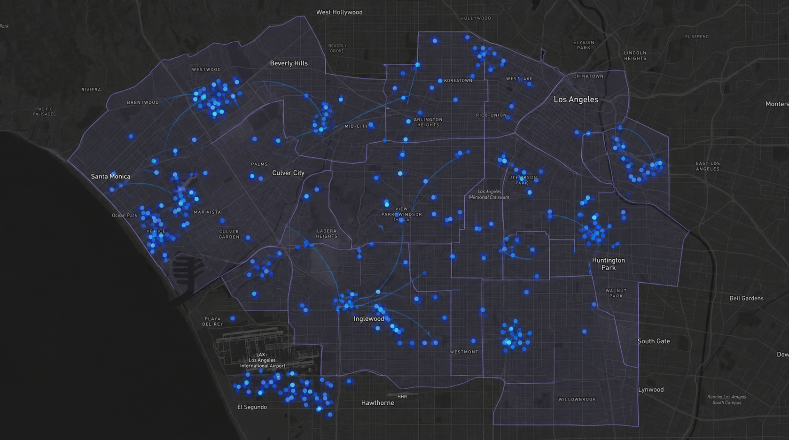

<div align="center">

# KenkoMirai

### A reproducible urban health scenario laboratory

<p>
  
  
  
  
  
</p>

<p>
  <a href="docs/setup.md"></a>
  <a href="docs/architecture.md"></a>
  <a href="docs/gallery.md"></a>
</p>

</div>

---

<p align="center">
  <a href="assets/simulation-districts-blue.png">
    
  </a>
</p>

KenkoMirai is a Mesa-based SEIRD simulation for exploring urban outbreak scenarios and intervention trade-offs. The canonical application combines Mesa 3 model and agent lifecycles, a versioned FastAPI service, a same-origin Next.js scenario workspace, transparent schedule templates, seeded behavior, and an optional Gymnasium training environment.

It is an engineering and research tool. It is **not** a clinical forecasting system, medical device, or source of public-health advice.

## What works now

- Each scenario is reproducible from an explicit random seed.
- Agents register with a Mesa `Model`, move through Mesa `AgentSet.do`, and retain the custom spatial contact index needed for geographic SEIRD transmission.
- Disease transitions use an explicit hourly clock, simultaneous SEIRD updates, configurable incubation/infectious durations, bounded transmission probabilities, and age-adjusted outcomes.
- The bundled mobility CSV is validated at startup and drives daily movement; census tract geometry and `POP20_TOTA` weights drive population clustering across 2,879 source records. Results expose the complete model configuration and a source fingerprint for traceability.
- Spatial contact lookup uses a grid index instead of scanning every agent pair.
- Lockdown is explicit; the simulator no longer toggles interventions on a timer.
- Adaptive control uses documented hysteresis: enter lockdown at 10% infectious prevalence and release below 4%.
- Interactive sessions have UUIDs, server-side input and total-lifetime limits, per-session locks, bounded compute admission, and idle expiry.
- `POST /api/v1/simulations/run` provides a deterministic batch path without retained session state.
- The browser calls a same-origin Next.js gateway, so no API hostname is hard-coded into client bundles.
- The frontend renders real API values and uses lightweight SVG maps and charts without external map tiles or fake browser data.
- Containers run as non-root users with health checks and read-only runtime filesystems.
- CI exercises backend tests, frontend lint/build, Compose parsing, and all three container image builds.
- RL training is opt-in and uses the current Gymnasium terminated/truncated API.
- Training and live runs share disease parameters, mobility input, geography input, and model-version metadata.

## Architecture

```text
Browser
  │ same-origin /api/backend/*
  ▼
Next.js gateway ─────► FastAPI /api/v1
                            │
                    validated session manager
                            │
              validated mobility + geography inputs
                            │
                    Mesa hourly SEIRD model
                     ┌──────┴──────┐
                     │             │
              spatial agents   intervention policy

Optional trainer ──► Gymnasium adapter ──► PPO checkpoint + metadata
```

See [docs/architecture.md](docs/architecture.md) for lifecycle, state transitions, failure behavior, and deployment boundaries.

## Quick start

Docker Compose is the shortest complete path:

```bash
cd infrastructure
docker compose up --build
```

After deployment, use `/simulation` and `/dashboard` on the configured frontend origin. The backend publishes `/docs` and `/api/v1/health` on its configured service origin. No environment-specific host is embedded in repository navigation.

Direct-development and Kubernetes procedures are in [docs/setup.md](docs/setup.md).

## API

| Method | Endpoint | Purpose |
|---|---|---|
| `GET` | `/api/v1/health`, `/api/v1/ready` | Liveness and readiness |
| `POST` | `/api/v1/simulations` | Create a bounded interactive session |
| `GET` | `/api/v1/simulations/{id}` | Read current session state |
| `GET` | `/api/v1/simulations/{id}/history` | Recover paginated trajectory samples |
| `POST` | `/api/v1/simulations/{id}/steps` | Advance under an explicit policy |
| `DELETE` | `/api/v1/simulations/{id}` | Release a session |
| `POST` | `/api/v1/simulations/run` | Run a deterministic batch scenario |

The original `/simulation`, `/simulate-step`, and `/health` routes remain compatibility aliases. New integrations should use `/api/v1`.

## Model semantics

| State | Meaning |
|---|---|
| `S` | Susceptible |
| `E` | Exposed and incubating |
| `I` | Infectious |
| `R` | Recovered |
| `D` | Deceased |

One step is one simulated hour. Daily mobility records remain active for 24 steps, while routines select destinations by hour of day. Schedules are generated from auditable demographic templates. The project does not expose, store, or claim hidden model reasoning traces. All scenario outputs depend on simplified assumptions and should be validated independently before research use.

## Repository map

| Path | Responsibility |
|---|---|
| `backend/` | Canonical FastAPI service and Mesa simulator |
| `frontend/` | Canonical Next.js experience and API gateway |
| `ml/` | Optional Gymnasium/PPO training path |
| `infrastructure/` | Compose and Kubernetes deployment |
| `initial datasets/` | Bundled mobility and geographic inputs |
| `docs/` | Architecture, decisions, and operations |
| `kenko/` | Excluded experiments; not part of the supported runtime |

## Project visuals

The animated dashboard walkthrough and supporting result views are organized in the [project gallery](docs/gallery.md). The supplied architectural concept is discussed in [architecture](docs/architecture.md), and the technology reference is reconciled with the shipped stack in [technology](docs/technology.md).

## Production boundary

Interactive sessions are stored in process memory. The supplied backend therefore uses one worker and the Kubernetes manifest uses one backend replica. Use the stateless batch endpoint for horizontally scaled work, or add an external session store before scaling interactive traffic. Compute admission is bounded inside one process, but cross-instance rate limiting is still an ingress concern. Place the frontend behind TLS and authentication appropriate to the deployment; no authentication layer is bundled.

## License

See [LICENSE](LICENSE).
