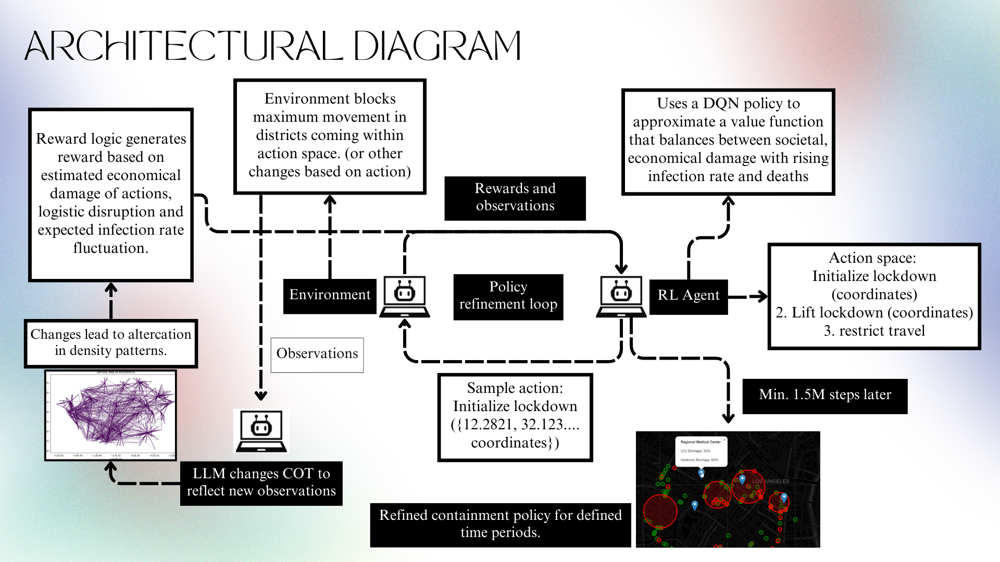

# Architecture

<p align="center">
  <a href="assets/architecture.png">
    
  </a>
</p>

The diagram above records the broader design exploration: district-level actions, DQN value approximation, an LLM-assisted refinement loop, and operational map outputs. The supported runtime implements the reliable subset described below. It uses Mesa for agent lifecycle, an optional PPO training path rather than DQN, and a transparent adaptive heuristic for live sessions. The depicted LLM reasoning loop is not executed or claimed by the current application.

## Canonical system

KenkoMirai has three active modules:

1. `frontend/`: Next.js pages, an API gateway, and dependency-light SVG visualizations.
2. `backend/`: FastAPI, input validation, bounded session management, and the seeded Mesa SEIRD model.
3. `ml/`: an optional Gymnasium adapter and PPO training entry point.

The `kenko/` directory contains excluded experiments with incompatible Flask and UI contracts. It is not copied into images, tested by CI, or deployed.

## Request lifecycle

```text
POST /api/backend/simulations
  └─► Next.js API gateway
        └─► POST /api/v1/simulations
              ├─ validate population, infections, seed, policy
              ├─ use startup-validated mobility and geography resources
              ├─ expire idle sessions and enforce capacity
              ├─ create seeded environment under UUID
              └─ return initial snapshot

POST /api/backend/simulations/{id}/steps
  └─► locate non-expired session
        ├─ acquire per-session lock
        ├─ enforce request, session-lifetime, and compute limits
        ├─ apply explicit or adaptive intervention
        ├─ move agents within bounded geography
        ├─ find contacts through spatial cells
        ├─ apply simultaneous SEIRD transitions
        └─ return final snapshot + every intermediate sample
```

## Simulation model

`CovidEnvironment` subclasses Mesa `Model`, and every person subclasses Mesa `Agent`. Mesa owns registration, seeded model randomness, time advancement through `Model.run_for`, removal, and ordered activation through `AgentSet.do`. KenkoMirai retains a custom latitude/longitude contact index because its geographic radius and simultaneous disease transitions are domain-specific.

The model tracks susceptible, exposed, infectious, recovered, and deceased states on an hourly clock. Agents receive demographic profiles and auditable daily schedule templates. Homes are sampled around census-tract bounding-box centers with `POP20_TOTA` as the sampling weight, restricted to the documented scenario bounds. Daily mobility deltas are converted to bounded activity multipliers and remain active for 24 hourly steps.

Each step:

1. Resolves the daily source-data mobility multiplier and intervention factor.
2. Activates living agents through Mesa `AgentSet.do` and moves them toward the destination associated with the current hour.
3. Indexes infectious agents in geographic cells.
4. Computes susceptible contacts in neighboring cells and validates distance with haversine distance.
5. Samples exposures with a combined-contact probability.
6. Advances existing exposed and infectious timers.
7. Commits all state transitions simultaneously.
8. Records aggregate and incident metrics.

The same seed and configuration produce the same trajectory in the same code version.

## Intervention policy

- `open`: normal movement.
- `lockdown`: movement is multiplied by the configured lockdown factor.
- `adaptive`: a transparent fallback controller enters lockdown at 10% infectious prevalence and releases below 4%.

The adaptive controller is not represented as a trained RL policy. A trained checkpoint remains opt-in and must be validated before serving decisions.

## State and scaling

Interactive sessions are held in a bounded, lock-protected process-local store with idle expiry. This makes local use predictable but prevents safe multi-worker or multi-replica interactive serving. The deployment stays at one API worker and one backend pod by design.

Session expiry skips active locks, deletion waits for in-flight work, total session history is capped by a configured lifetime, and a bounded process-level compute semaphore rejects excess work rather than queuing it indefinitely.

The batch endpoint creates no retained session and is the correct path for horizontally distributed jobs. An external state store is the required extension point before scaling interactive traffic.

## Failure behavior

- Invalid populations, infections, policies, seeds, and step counts return validation errors.
- Missing or expired sessions return `404`.
- Capacity exhaustion returns `409`.
- Busy compute capacity returns retryable `429`; work-limit violations return `422`.
- Unexpected failures are logged and return a generic `500` with a request ID.
- The frontend gateway converts upstream connection failures to `502` and its configured timeout to `504`.
- Missing or malformed configured datasets prevent readiness by failing service startup.
- No browser fallback manufactures scenario data.

## Security boundary

The API validates trusted hosts, restricts CORS methods and headers, adds request IDs, and runs in a non-root read-only container. Authentication, authorization, TLS termination, rate limiting across instances, and durable scenario storage belong at the platform boundary and are not bundled.
