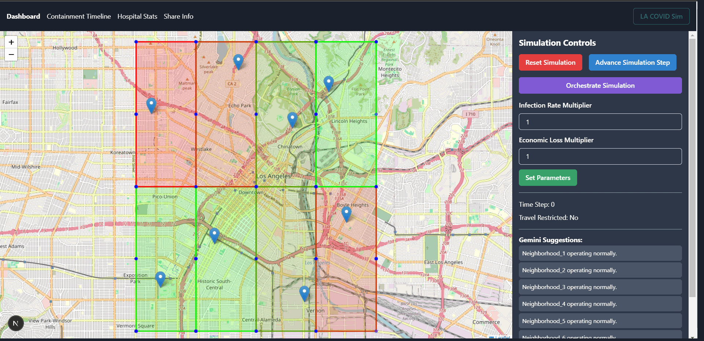
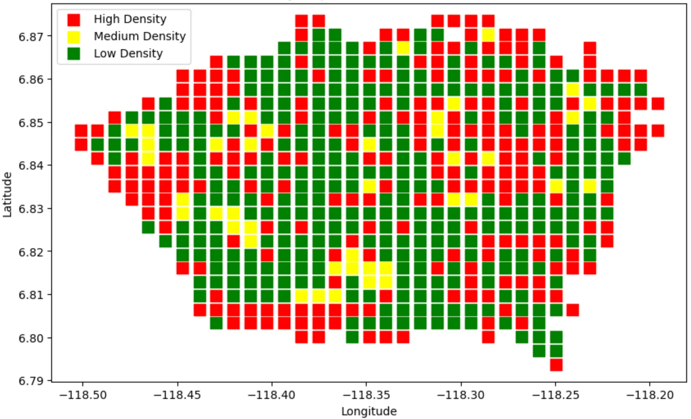
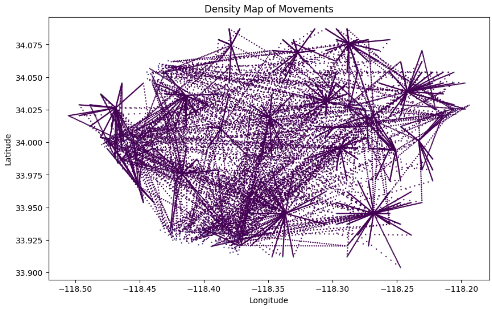

# Project gallery

## Dashboard walkthrough

  

The animation records the project’s map-led dashboard direction, including containment controls, neighborhood overlays, hospital status, and orchestration concepts. The supported interface now uses the versioned simulation API and dependency-light SVG views; operational claims should be evaluated against the current code rather than inferred from this visual.

## Simulation outputs

<table>
  <tr>
    <td width="50%"></td>
    <td width="50%"></td>
  </tr>
  <tr>
    <td align="center">Spatial infection-density analysis</td>
    <td align="center">Movement-density analysis</td>
  </tr>
</table>

These are scenario and design artifacts, not epidemiological forecasts or clinical guidance.
