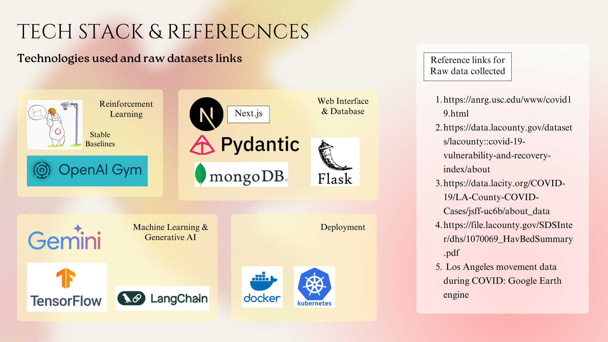

# Technology

<p align="center">
  <a href="assets/technology-stack.png">
    
  </a>
</p>

This supplied stack image captures the project’s wider experimentation. The table below distinguishes that design exploration from dependencies used by the supported runtime.

| Area | Supported implementation | Status of technologies pictured above |
|---|---|---|
| Agent simulation | [Mesa 3.5.1](https://mesa.readthedocs.io/stable/) with custom spatial SEIRD transitions | Mesa is explicit in code and dependency manifests. |
| API and validation | FastAPI and Pydantic | Flask belongs to the excluded experiment; it is not deployed. |
| Web application | Next.js and React | Next.js remains the supported interface. |
| Policy experiments | Gymnasium and Stable-Baselines3 PPO | The earlier Gym interface is replaced by Gymnasium. The shipped trainer uses PPO, not DQN. |
| Data | Mobility CSV, LA County census shapefile, PyShp | MongoDB is not required; supported sessions are bounded and process-local. |
| Generative AI | None in the supported execution path | Gemini, TensorFlow, and LangChain are design references only; no hidden reasoning loop is claimed. |
| Deployment | Docker Compose and Kubernetes | Both have maintained manifests, health checks, security contexts, and CI image builds. |

## Runtime flow

```text
LA mobility + census geography
             │
             ▼
       Mesa SEIRD model
             │
      FastAPI session API
             │
    Next.js server gateway
             │
   browser scenario workspace

Optional: Mesa model → Gymnasium adapter → Stable-Baselines3 PPO checkpoint
```

Dependency versions are pinned in [`backend/requirements.txt`](../backend/requirements.txt), [`ml/requirements.txt`](../ml/requirements.txt), and the root npm lockfile.
